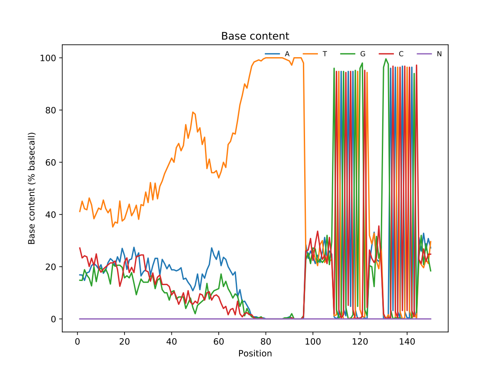

# fastqplot

fastq stat and plot.

因为我只需要这个图，所以现在只支持fastq的统计。以后慢慢加




# Usage

```
Usage: fastqplot [OPTIONS]

  Stat the fastq file and plot the base distribution plot

Options:
  --fq TEXT  The fastq file input, gzip or not alse fine
  --fp TEXT  The outputfile prefix(fp).
  --revx     Reverse the base location(x axis), defaule:False.
  --revn     Reverse the nucleobase, defaule:False.
  --help     Show this message and exit.

```


# TODO

- [ ] Reads quality distribution
- [ ] Reads length density
- [ ] GC content

